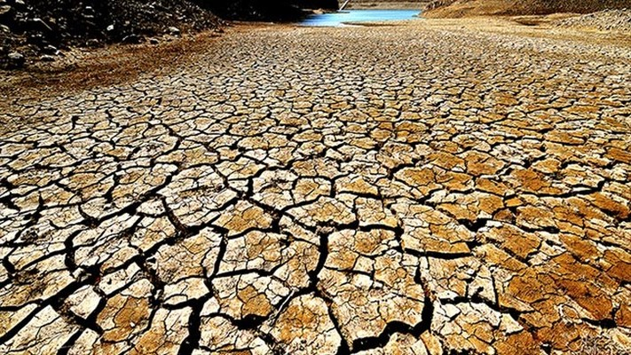

##boxplots

```{r clim, eval=TRUE, echo=TRUE, warning=FALSE}
clim = read.table("clim.txt", header=TRUE)
Aggdata <- aggregate(clim, by=list(clim$month, clim$year), FUN="mean")
Aggdata$Tmean <- (Aggdata$tmax+Aggdata$tmin)/2
boxplot(Aggdata$Tmean ~ Aggdata$month,main ="Average temperature by month from 1942 to 2016", ylab="Temperature", xlab="month", col="orange")
boxplot(Aggdata$rain~Aggdata$month,main ="Precipitation by month from 1942 to 2016", ylab="Precipitation", xlab="month", col="blue")
boxplot(Aggdata$rain~Aggdata$year,main ="Precipitation by year from 1942 to 2016", ylab="Precipitation", xlab="year", col="skyblue")

# Aggregate precipitation by year 
clim2 <- clim[,2:7]
Aggdata2 <- aggregate(clim2, by=list(clim2$year), FUN="sum")

# what is the wettest year  (precipitation per year)
Wetyear=which.max(Aggdata2$rain)
Aggdata2[Wetyear,c("Group.1","rain")]
Aggdata2$year= as.integer(Aggdata2$Group.1)
Aggdata2$rain = as.integer(Aggdata2$rain)
Aggdata2[Wetyear,c("year","rain")]


# what is the driest year (precipitation per year)
Dryyear=which.min(Aggdata2$rain)
Aggdata2[Dryyear,c("Group.1","rain")]
Aggdata2[Dryyear,c("year","rain")]


```

## The pictur of a dry year

<div align="left">

</div>

## The picture of a wet year

<div align="left">

</div>


## Season
```{r eval=TRUE, echo=TRUE, warning=FALSE}
clim2$Season <- ifelse(clim2$month <= 5 & clim2$month >= 3, 1, ifelse(clim2$month <= 8, 2,(ifelse(clim2$month <= 11, 3, 4))))
## the wettest season (mean season precipitation)
Aggdata4 <- aggregate(clim2, by=list(clim2$Season, clim2$year), FUN="sum")
Seasonagg <- Aggdata4[,c(1,2,5)]
colnames(Seasonagg) <- c("Season", "year", "rain")
c("Season","year","tmax","tmin","rain","summedyear","")
Aggdata3 <-aggregate(Seasonagg, by=list(Seasonagg$Season), FUN="mean")
Wetseason = which.max(Aggdata3$rain)
Aggdata3[Wetseason,c("Group.1","rain")]
Aggdata3$rain = as.integer(Aggdata3$rain)
Aggdata3[Wetseason,c("Season","rain")]

## the driest season (mean season precipitation)
Dryseason = which.min(Aggdata3$rain)
Aggdata3[Dryseason,c("Group.1","rain")]
Aggdata3$rain = as.integer(Aggdata3$rain)
Aggdata3[Dryseason,c("Season","rain")]


## relationship between precipitation and temperature 
Aggdata5 <- aggregate(clim2, by=list(clim2$Season, clim2$year), FUN="mean")
Aggdata5$Tmean <- (Aggdata5$tmax + Aggdata5$tmin)/2
Summertem <- subset(Aggdata5, Season == 2)
Winterrain <- subset(Aggdata5, Season == 4)
Reltemrain <- merge(Summertem, Winterrain,by="year")

library(ggplot2)
ggplot(Reltemrain, aes(Tmean.x,rain.y))+
  geom_point(size=2)+ # creat scatter plot, and dot as blank circles
  geom_smooth(method="lm", se=FALSE)+ # creat a trend line
  xlab("Average Temperature") + 
  ylab("Average Precipitation") +
  ggtitle("relationship between summer temperature and winter precipitation")+
  theme_bw() +
  theme(text=element_text(family ="Times", size=14), panel.grid.major = element_blank(),panel.grid.minor = element_blank())


```


